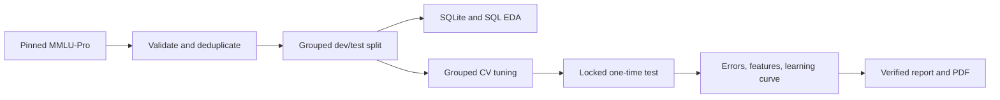
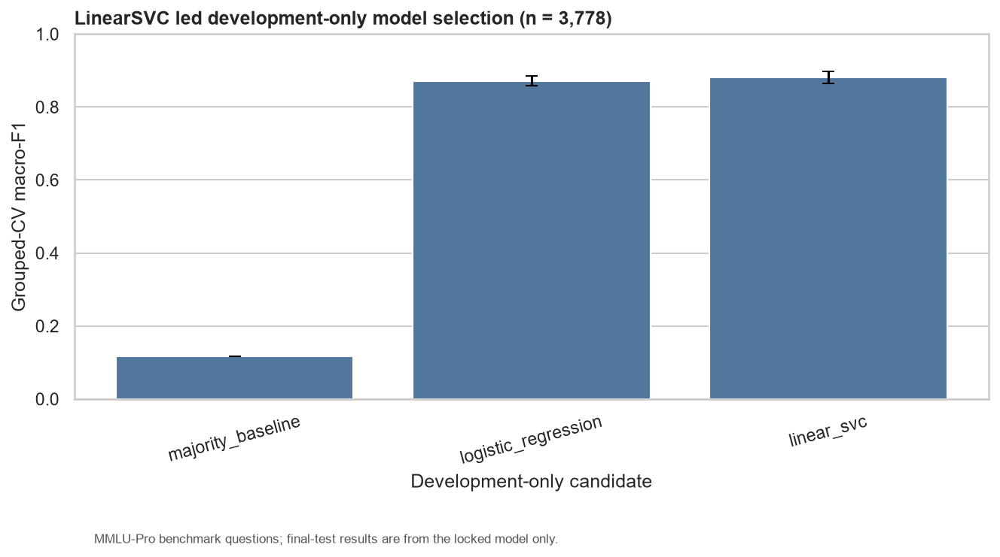
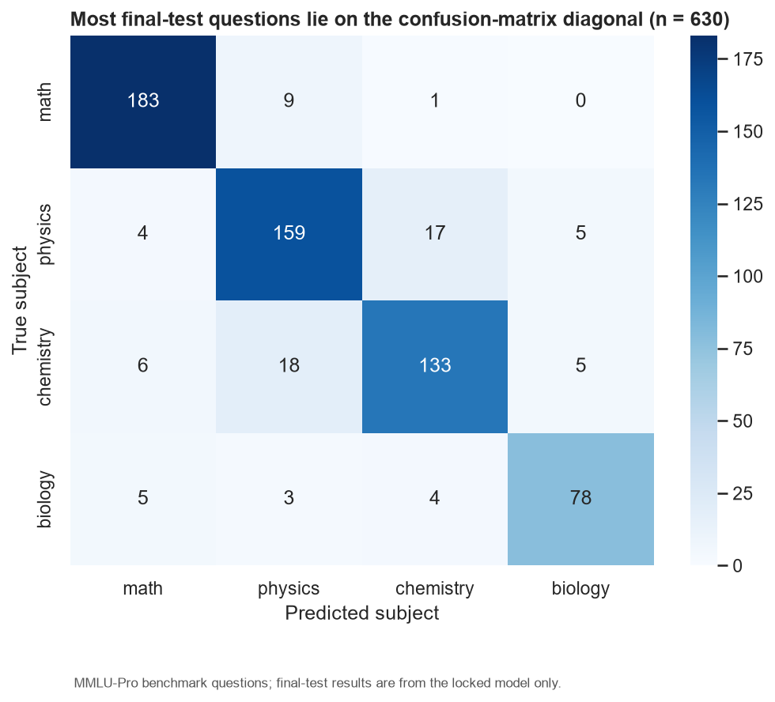
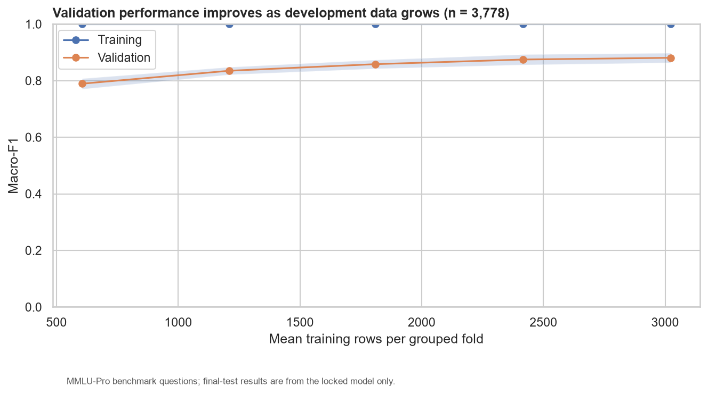

# STEM Learning Analytics - End-to-End ML Workflow

[](https://github.com/pepeboom120/Internship/actions/workflows/ci.yml)
[](https://github.com/pepeboom120/Internship/releases)
[](pyproject.toml)
[](LICENSE)

An evidence-grounded feasibility study that classifies English STEM benchmark questions into mathematics, physics, chemistry, or biology using a leakage-safe TF-IDF and linear-model workflow.

這是一個可重現的端到端機器學習作品集。重點不是前端 demo，而是資料治理、SQL、去重與防洩漏切分、超參數調整、一次性測試集評估、錯誤診斷與限制分析。

## Result

**Conditional go - Validated Offline Prototype.** The locked linear_svc achieved:

- **Macro-F1: 0.8755** (95% stratified bootstrap CI 0.8471-0.8996)
- **Accuracy: 0.8778** (553/630 final-test predictions correct)
- **Grouped-CV macro-F1: 0.8807 +/- 0.0171** before the final test was opened

The model is suitable as an offline four-subject routing prototype. It is not evidence of production readiness, student behavior, calibrated confidence, or guaranteed cross-source generalization.







## Review This Project in Five Minutes

1. Read the [one-page project brief](docs/project_brief.pdf) for the problem, workflow, results, and limits.
2. Inspect the persisted [model selection decision](artifacts/runs/4881283f146d/selection_decision.json) to see how the final model was locked without test access.
3. Review the confusion matrix and [error-slice table](reports/tables/error_slices.csv), especially the weaker chemistry class and short-question errors.
4. Read the [capability boundaries](docs/limitation_register.md) and the explicit `not_feasible` source-holdout result.
5. Run `stem-analytics run-all --config configs/project.yaml` to see the visible cache and reproducible stage contracts.

For a spoken walkthrough, use the [interview guide](docs/interview_guide.md). Resume-ready descriptions are in [resume assets](docs/resume_assets.md).

## Key Technical Decisions

- Only normalized question text is a feature; answers and explanations are prohibited.
- 91 exact duplicates were removed and 0 duplicate groups cross the final split.
- TF-IDF is fitted inside each grouped CV fold; macro-F1 drives selection across 72 candidate configurations.
- The final test set is evaluated once after the selection decision and hashes are persisted.
- LinearSVC margins are not presented as calibrated probabilities.
- SQL, manifests, metrics, figures, Markdown, and PDFs derive from controlled artifacts.

## Findings and Limits

- Chemistry is the weakest class at F1 0.8391; Math is strongest at 0.9361.
- Questions below 100 characters have a 19.7% error rate.
- Source and subject are strongly confounded, so the predeclared cross-source holdout is not feasible with this dataset.
- The learning curve continues to improve with additional development data, supporting targeted data collection rather than unsupported model complexity.

## Local Reproduction

```powershell
python -m venv .venv
.\.venv\Scripts\python -m pip install -e ".[dev]"
.\.venv\Scripts\stem-analytics run-all --config configs/project.yaml
.\.venv\Scripts\python -m pytest -q
```

Individual stages: `fetch`, `validate`, `build-db`, `analyze`, `train`, `evaluate`, `diagnose`, and `report`.

## Project Evidence

- [One-page project brief](docs/project_brief.pdf)
- [Full Markdown report](docs/final_report.md)
- [Verified 15-page technical report](docs/final_report.pdf)
- [Reproducibility guide](docs/reproducibility.md)
- [Evidence matrix](reports/qa/evidence_matrix.csv)
- [Numerical consistency register](reports/qa/numerical_consistency_register.csv)
- [PDF QA report](reports/qa/pdf_qa_report.md)

## Repository Map

- `src/stem_analytics/`: importable pipeline and CLI code
- `sql/`: constrained schema and ten named analytical queries
- `reports/`: generated figures, tables, and QA registers
- `artifacts/`: public-safe manifests, locked metrics, and run decisions
- `tests/`: unit, integration, PDF, and clean-room verification tests

Dataset: `TIGER-Lab/MMLU-Pro` at pinned revision `b189ec765aa7ed75c8acfea42df31fdae71f97be` under the upstream license note. Raw data, SQLite, predictions, and model binaries rebuild locally and are not committed. Code is MIT licensed.
