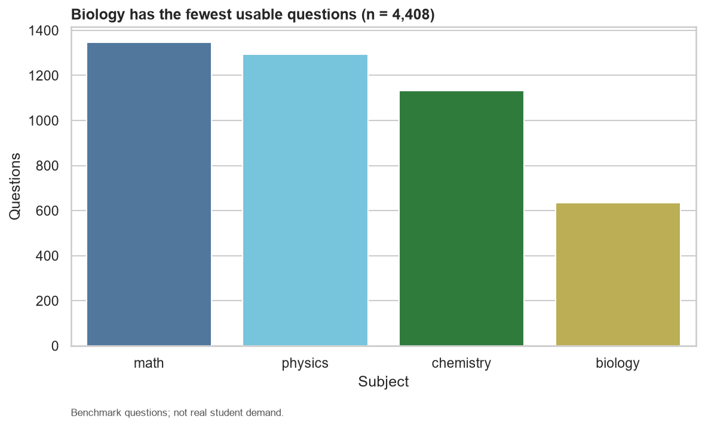
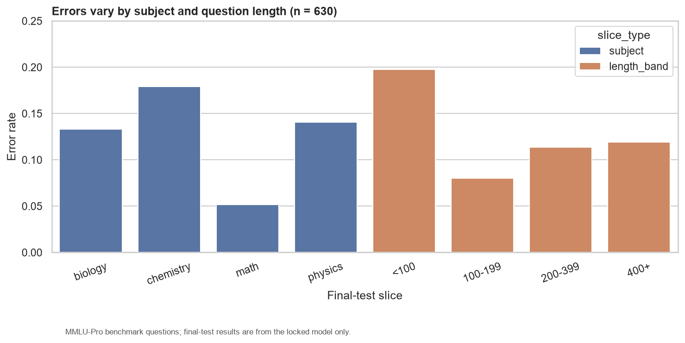

# End-to-End STEM Subject Classification

## 1. Executive Summary

This study tests whether question text alone can classify English STEM benchmark questions as mathematics, physics, chemistry, or biology. The locked linear_svc reached **macro-F1 0.8755** (95% stratified bootstrap CI 0.8471–0.8996) and accuracy 0.8778 on 630 isolated questions. The result supports a **conditional feasibility decision** as a validated offline prototype, not production deployment.

## 2. Problem and Decision

The practical question is whether a leakage-controlled classical ML pipeline can route a question to one of four subject queues. Success means materially beating the majority baseline while identifying failure modes and operational limits.

## 3. Data Source and Governance

The source is `TIGER-Lab/MMLU-Pro` revision `b189ec765aa7ed75c8acfea42df31fdae71f97be`. 4499 source rows were selected. Raw records, answer choices, answers, and explanations are not model features and are not committed.

## 4. Data Validation

Validation retained 4408 of 4499 rows and excluded 91 exact duplicates. It produced 4334 duplicate groups and verified **0 crossing groups** between development and test.

## 5. Exploratory Analysis

Biology has the smallest controlled class. Source composition is strongly tied to subject, which creates a shortcut and external-validity risk.

## 6. SQL Analytical Layer

SQLite stores controlled questions, model runs, and predictions with foreign keys and label constraints. Ten named SQL queries reproduce distributions, quality checks, error slices, and confusion pairs.

## 7. Leakage Control

The final test fold was isolated before tuning. Exact duplicates were removed, near-duplicate groups were kept within a single split, TF-IDF was fitted inside each pipeline fold, and hyperparameters were selected using five-fold `StratifiedGroupKFold` only.

## 8. Modeling and Hyperparameter Tuning

The majority baseline, TF-IDF + Logistic Regression, and TF-IDF + LinearSVC were compared with macro-F1. LinearSVC was locked at development CV macro-F1 0.8807 ± 0.0171 using `C=10.0`, `min_df=1`, and n-grams [1, 2].

## 9. Evaluation Definitions

Macro-F1 gives each class equal weight. Precision measures how often a predicted class is correct; recall measures how much of a true class is recovered; weighted-F1 weights class F1 by support. The confusion matrix counts every true/predicted pair. The bootstrap interval resamples within each true class to preserve class composition.

## 10. Final-Test Results

The locked model achieved macro-F1 **0.8755**, weighted-F1 0.8774, and accuracy 0.8778. The 95% interval is 0.8471–0.8996. This confirms strong offline separation but does not establish real-world generalization.

## 11. Errors and Slice Analysis

Chemistry is weakest (F1 0.8391); mathematics is strongest (F1 0.9361). Questions under 100 characters have the highest length-band error rate. These findings suggest targeted data review rather than a global model change.

## 12. Feature and Shortcut Analysis

Coefficient inspection shows domain terms but also source-concentrated features. Because source names and subjects are highly confounded, learned lexical cues may not transfer to new providers.

## 13. Learning Curve and Robustness

Validation macro-F1 rises from 0.7891 at 20% to 0.8807 at full development size. No source met the predeclared requirement of 80 rows and all four classes, so source holdout is honestly recorded as not feasible.

## 14. Model Capability Boundaries

This is a **validated offline prototype**. It does not validate real student behavior, educational decisions, calibrated automation, production readiness, non-English inputs, image questions, or guaranteed cross-source generalization. LinearSVC margins are not probabilities; confidence/coverage automation is intentionally not claimed.

## 15. Reproducibility

The dataset revision, configuration, split seed, hashes, SQL, tests, and stage commands are versioned. See [reproducibility.md](reproducibility.md), the evidence matrix, numerical consistency register, and figure source register.

## 16. Intent Annotation Future Work

Intent prediction is deferred because no trustworthy intent label exists. The repository provides a taxonomy and deterministic 40-question pilot template, but does not claim that human annotation, agreement measurement, or an intent model has occurred.

## Conclusion

The workflow demonstrates an end-to-end, auditable ML feasibility study. The model is promising for offline four-subject routing, conditional on source-shift validation and probability calibration before operational automation.
